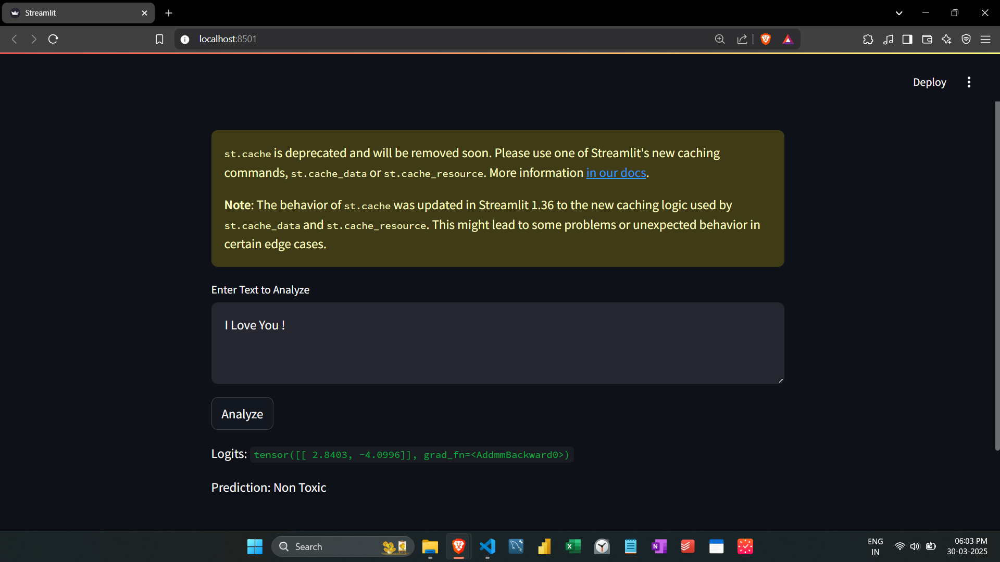
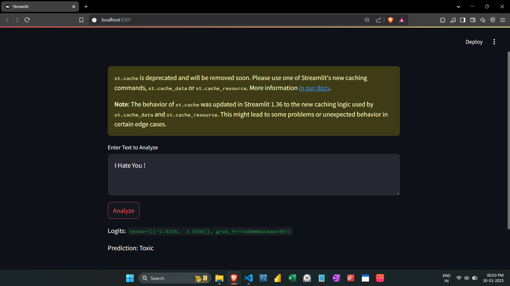

# 🚀 Toxic Comment Classification
A BERT-based NLP model to classify whether a given comment is toxic or non-toxic.

---

## 🎯 Key Message
> "This project leverages BERT to accurately classify toxic comments, enhancing content moderation efficiency."

---

## ✅ Answer
By fine-tuning the BERT model using the **Hugging Face Trainer API**, we developed an efficient classification system that can detect toxic comments with high accuracy. The model is deployed via **Streamlit**, enabling real-time predictions.

---

## 📌 Supporting Arguments

🔹 **State-of-the-Art NLP Model** – Utilizes **BERT** from Hugging Face, a leading transformer-based model for NLP tasks.

🔹 **Efficient Data Handling** – Implements a dataset class for **chunk-wise data loading**, optimizing memory usage.

🔹 **Fine-Tuning on Real Data** – Trained on **10,000 samples** from the Kaggle **Toxic Comment Classification Challenge** dataset.

🔹 **Hugging Face Integration** – The fine-tuned model is **pushed to Hugging Face** for easy accessibility.

🔹 **Optimized Streamlit Deployment** – Uses **caching** to prevent redundant model loading, improving performance.

🔹 **Interactive User Interface** – Provides a **text input box** and an **"Analyze" button** for real-time toxicity detection.

---

## 📊 Supporting Data or Facts

📌 **Dataset:** Kaggle’s **Toxic Comment Classification Challenge**

📌 **Model:** **BERT** fine-tuned for **binary classification** (toxic/non-toxic)

📌 **Training Strategy:** Used **Hugging Face Trainer API** for efficient training

📌 **Deployment:** Hosted on a **Streamlit application**, fetching the model from Hugging Face

📌 **Performance:** Achieved **high accuracy** in detecting toxic comments

---


## ⚡ How to Use?
1️⃣ **Run the Streamlit App**
   ```bash
   streamlit run app.py
   ```
2️⃣ **Enter a comment** in the text box.
3️⃣ **Click** the "Analyze" button to see whether the comment is toxic or not.

---

🚀 **Enhance online conversations with smart toxicity detection!** 🎯

